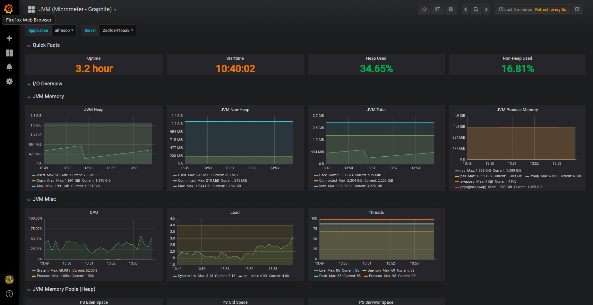

# Alfred Telemetry

Alfred Telemetry integrates Alfresco and [Micrometer](https://micrometer.io/), an application metrics facade that 
supports numerous monitoring systems.

> To learn more about Micrometer’s capabilities, please refer to its [reference documentation](https://micrometer.io/docs)
> , in particular the [concepts section](https://micrometer.io/docs/concepts).



## Getting Started

These instructions will get you a copy of the project up and running on your local machine for development and 
testing purposes. See ['Installing the extension in Alfresco'](#installing-the-extension-in-alfresco) for notes on how 
to install Alfred Telemetry in the Alfresco Platform.

### Prerequisites

The Alfred Telemetry Alfresco extension **compiles** against Alfresco Enterprise Edition because:
* it includes metrics for some enterprise components (e.g. Hazelcast cache)
* it contains an implementation of the `MetricsController` interface, which is only available since AEE 6.1.

> Please note that although Alfred Telemetry compiles against AEE, it **does work on ACE**. Necessary abstractions 
> are made to hide enterprise only features when running on community edition.

This means access to the [private Alfresco Nexus repository](https://artifacts.alfresco.com/nexus/content/groups/private)
is required to build this project. To access this repository, the following two Gradle properties need to 
be present when the build is executed:

```properties
org.alfresco.maven.nexus.username
org.alfresco.maven.nexus.password
```

Gradle provides several mechanisms to provide these properties, which are thoroughly described in the 
[official Gradle documentation](https://docs.gradle.org/current/userguide/build_environment.html#sec:gradle_configuration_properties).

### Installing

The Gradle `assemble` task can be used to build the Simple Module and AMP artifact:

```
./gradlew assemble
```

After execution, the artifacts will be available in the `build/libs` and `build/dist` directories.

## Running the tests

### Unit tests

Unit tests can be executed with the Gradle `test` task:

```
./gradlew test
```

### Integration tests

TODO

## Installing the extension in Alfresco

Alfred Telemetry is available both as an [Alfresco Simple Module](https://docs.alfresco.com/6.1/concepts/dev-extensions-packaging-techniques-jar-files.html) and as an 
[Alfresco Module Package](https://docs.alfresco.com/6.1/concepts/dev-extensions-packaging-techniques-amps.html)

### Maven Central Coordinates

All required artifacts are available in Maven Central, with following artifact coordinates:

```xml
<!-- Alfresco Simple Module: -->
<dependency>
    <groupId>eu.xenit.alfred.telemetry</groupId>
    <artifactId>alfred-telemetry-platform</artifactId>
    <version>${last-version}</version>
</dependency>
<!-- Alfresco Simple Module: -->
<dependency>
    <groupId>eu.xenit.alfred.telemetry</groupId>
    <artifactId>alfred-telemetry-platform</artifactId>
    <version>${last-version}</version>
    <type>amp</type>
</dependency>
```

```groovy
// Alfresco Simple Module: 
alfrescoSM "eu.xenit.alfred.telemetry:alfred-telemetry-platform:${latest-version}"
// Alfresco Module Package:
alfrescoAmp "eu.xenit.alfred.telemetry:alfred-telemetry-platform:${latest-version}@amp"
```

These artifacts can be used to automatically install Dynamic Extensions in Alfresco using e.g. the Alfresco Maven SDK 
or the [Alfresco Docker Gradle Plugins](https://github.com/xenit-eu/alfresco-docker-gradle-plugin)

### Manual download and install
Please consult the official Alfresco documentation on how to install Simple Modules and Module Packages manually.

### Supported Alfresco versions

Alfred Telemetry aims to support all Alfresco versions (both Community and Enterprise Edition) starting from, 
and including, Alfresco 5.0.

## Documentation

How to setup metrics exposure to different monitoring systems and how to create custom metrics, is described 
in the [project's documentation](docs)

## License

This project is licensed under the GNU Lesser General Public License v3.0 - see the [LICENSE.txt](LICENSE.txt) file for details.

